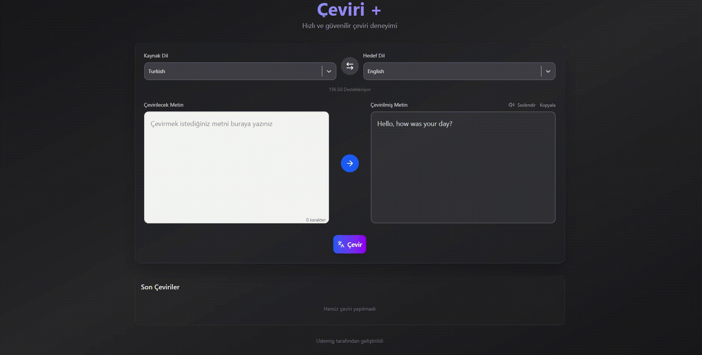

# 🌐 Çeviri+ (Translate App)

Modern, hızlı ve güvenilir bir çeviri deneyimi sunan **Çeviri+**, kullanıcıların metinlerini anında çevirmesini ve sesli dinlemesini sağlayan bir React tabanlı uygulamadır.

## Ekran Görüntüsü

## 🚀 Özellikler

- 🌍 **Dil Algılama:** Kaynak dil otomatik olarak algılanabilir.
- 🔄 **Dil Değiştirme:** Kaynak ve hedef dilleri tek tıkla yer değiştir.
- 🗣️ **Seslendirme:** Hem orijinal hem çevrilmiş metni dinle.
- 📋 **Kopyalama:** Çevrilmiş metni tek tuşla kopyala.
- 🕒 **Çeviri Geçmişi:** Yapılan çeviriler geçmişte saklanır.
- ⚡ **Redux Toolkit:** Global state yönetimi için.
- 🎨 **TailwindCSS:** Modern, karanlık temalı kullanıcı arayüzü.

---

## 🧩 Kullanılan Teknolojiler

**React.js** | Arayüz oluşturma
**Redux Toolkit** | State yönetimi
**Lucide React** | İkonlar
**TailwindCSS** | Stil yapısı
**SpeechSynthesis API** | Metin seslendirme
**Clipboard API** | Metin kopyalama
**Async Thunk (translateText)**

🧠 Kullanım

Kaynak ve hedef dilleri seç.

Metni yaz veya yapıştır.

“Çevir” butonuna bas (otomatik çeviri tetikleniyorsa bekle).

Metni seslendirebilir veya kopyalayabilirsin.

Geçmiş bölümünden önceki çevirilere erişebilirsin.
